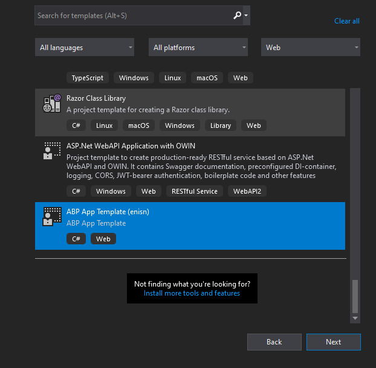
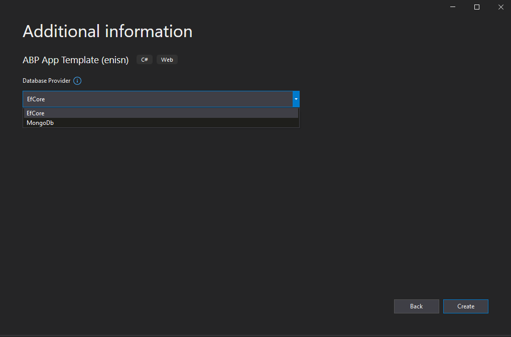

# ABP-dotnet-template
 Dotnet template version of ABP Framework.


## Installation

- Install templates from nuget:

```bash
dotnet new -i Enisn.Abp
```

- Create a project with CLI
  - EntityFrameworkCore

    ```bash
    dotnet new abp -D EfCore
    ```

  - MongoDb

    ```bash
    dotnet new abp -D MongoDb
    ```


- Create a project with IDE

  All installed templates will be visible at your IDE

  

  All parameters are selectable on IDE UI

  
